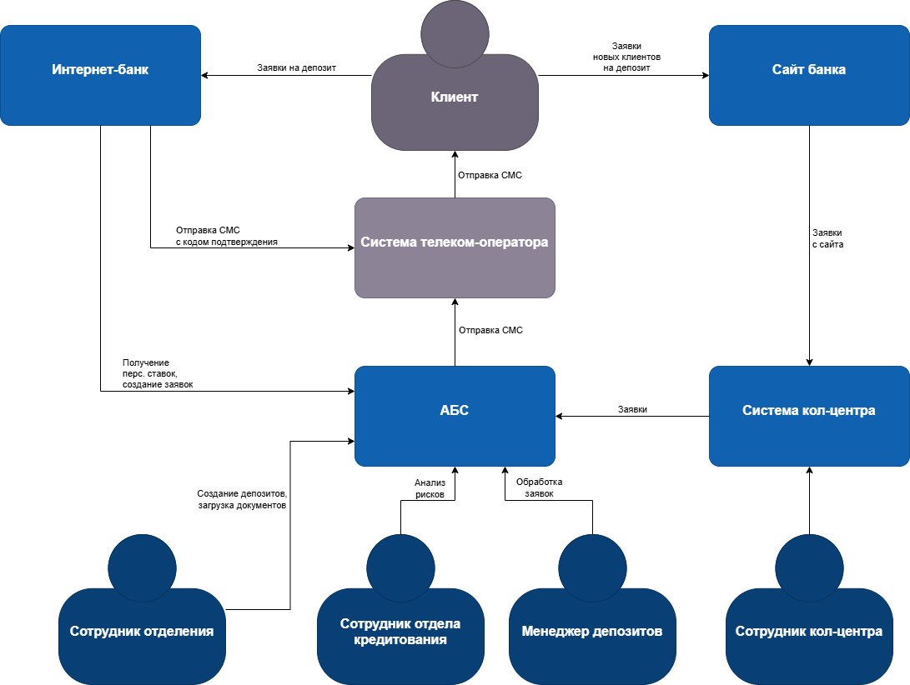
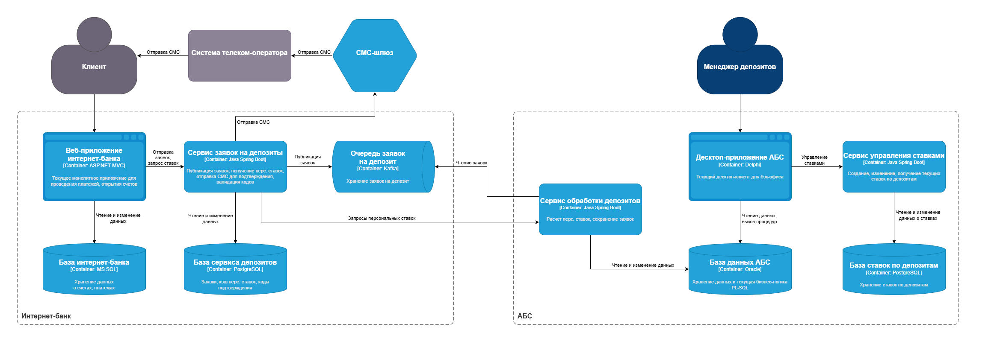

### **Название задачи: STD-ADR1 MVP Открытие депозитов онлайн** 
### **Автор: Маслов К.Е.**
### **Дата: 31.05.2025**

### **Контекст и проблема**
Чтобы развиваться дальше, компании нужно привлечь больше клиентов, которые относятся к более молодым категориям. Поэтому сейчас в приоритете развитие онлайн-каналов для привлечения и обслуживания клиентов.

Цель на год — сделать так, чтобы клиент мог полностью автоматически открыть депозит или накопительный счёт в интернет-банке, а при обращении в отделение депозит открывался без участия сотрудников бэк-офиса. Но для этого сначала нужно реализовать MVP, где можно оформить заявку на депозит онлайн. Обрабатывать заявки продолжат сотрудники бэк-офиса.

Также в ближайшей перспективе компания хочет, чтобы на сайте можно было подать заявку на депозит. Когда потенциальный клиент отправит заявку, с ним свяжется менеджер из кол-центра и расскажет об условиях по депозиту. 

### **Функциональные требования**

|**№**|**Действующие лица или системы**|**Use Case**|**Описание**|
| :-: | :- | :- | :- |
|UC1|Пользователь, Сайт, Система кол-центра|Подача заявок от новых клиентов|1. Пользователь заходит на сайт 2. Пользователь переходит в раздел с описанием депозитов 3. Сайт отображает актуальные ставки по депозитам 4. Пользователь заполняет и отправляет заявку 5. Сайт сохраняет заявку и отправляет ее в систему кол-центра|
|UC2|Пользователь, Интернет-банк, АБС, СМС-шлюз|Подача заявок от существующих клиентов|1. Пользователь авторизуется в интернет-банке 2. Пользователь переходит в раздел депозитов 3. Интернет-банк запрашивает у АБС персонализированные ставки для клиента 4. Интернет-банк отображает актуальные и персонализированные ставки 5. Пользователь выбирает депозит 6. Интернет-банк предлагает указать счёт и сумму 7. Пользователь заполняет данные и отправляет заявку 8. Интернет-банк генерирует и сохраняет код подтверждения 9. Интернет-банк отправляет в СМС-шлюз команду для отправки СМС с кодом подтверждения 10. Пользователь получает СМС 11. Пользователь вводит код 12. При успехе Интернет-банк передаёт заявку в АБС|
|UC3|Менеджер депозитов, АБС, СМС-шлюз|Обработка заявки из интернет-банка|1. Менеджер депозитов открывает заявку в АБС 2. Менеджер депозитов анализирует заявку 3. В случае положительного решения менеджер подтверждает заявку 4. АБС создает депозит 5. АБС отправляет в СМС-шлюз команду для отправки уведомления клиенту|
### **Нефункциональные требования**

|**№**|**Требование**|
| :-: | :- |
| R1  | Все сервисы должны работать 24/7 |
| R2  | Доступность сервисов должна составлять 99,9% времени |
| P1 | Отклик по всем операциям должен занимать не более 100 миллисекунд |
| P2 | Возможность горизонтального масштабирования всех компонентов |
| P3 | Возможность равномерного распределения запросов между серверами |
| +R1 | Следует по возможности избегать привлечения подрядчика для доработок ядра системы |
| +R2 | Требуется шифрование трафика на сайте и в интернет-банке |
| +R3 | АБС может масштабироваться только вертикально из-за своей базы данных |
| +R4 | Нужно как можно больше использовать технологии, которые уже есть в банке |
| +R5 | Можно развернуть новые технологии, но необходимо, чтобы они были совместимы с существующими платформами разработки |
| +R6 | Если нужны очереди сообщений, то лучше использовать Kafka |
| +R7 | Текущая версия платформы интернет-банка несовместима с Kafka |

### **Решение**
Диаграмма контекста:

Диаграмма контейнеров:

Ключевые положения выбранного решения:
1. Передачу заявок из интернет-банка в АБС реализуем через очередь, чтобы контролировать нагрузку на АБС - если писать в АБС напрямую, при росте трафика с интернет-банка есть риск положить АБС.
1. Для реализации очереди выбираем Kafka исходя из требования +R6
1. Согласно требованию +R7, писать в Kafka будем через отдельный новый микросервис. Это также соответствует ограничению +R1
1. Этот микросервис будет содержать всю логику для реализации сценария UC2 со стороны интернет-банка.
1. Для микросервиса потребуется своя база данных. В ней мы будем кэшировать на определенное время персональные ставки, чтобы также контролировать нагрузку на АБС и не дергать ее при каждом запросе пользователя.
1. На стороне АБС реализуем новый микросервис для чтения заявок из очереди и записи их в существующую базу, а также расчета персональных ставок. Отдельную базу для этого в MVP не создаем, пока встраиваемся в существующую логику в основной базе. Однако в дальнейшем стоит сделать выделенную базу данных для обеспечения масштабирования этого функционала, принимая во внимание требование +R3
1. Создаем еще один новый микросервис в АБС для управления ставками на замену Excel. Для него сразу делаем свою базу, поскольку это новый автономный процесс.
1. Все новые микросервисы будем делать на Java Spring Boot + PostgreSQL исходя из требования +R4 и движения в сторону open source решений.
1. Весь трафик должен передаваться по HTTPS исходя из требования +R2

### **Альтернативы**
1. Обращаться напрямую из интернет-банка в базу данных АБС без очереди и отдельных микросервисов.
1. Хранить ставки в основной базе АБС и реализовать управление ставками в процедурах PL-SQL

**Недостатки, ограничения, риски**

1. Kafka это новая технология в IT-ландшафте, разработчики могут не иметь опыта работы с ней. Предложения по снижению: Организовать тренинг для команды.
1. В процессе получения ставок будут прямые запросы из сервиса интернет-банка, который доступен публично, в сервис АБС, который расположен во внутреннем контуре и не должен быть доступен извне. Предложения по снижению: Ограничение доступа по IP, api key, лимиты на количество запросов.

