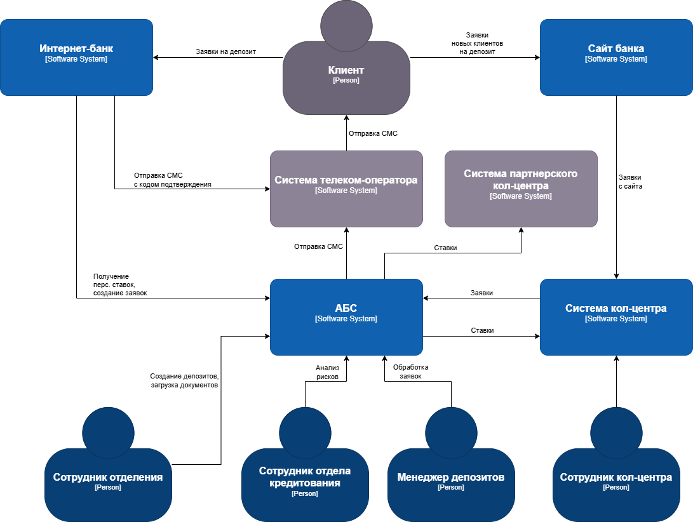
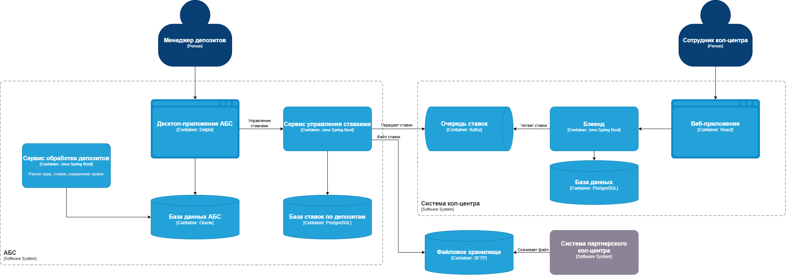

### **Название задачи: STD-ADR2 MVP Передача ставок в кол-центр** 
### **Автор: Маслов К.Е.**
### **Дата: 03.06.2025**
### **Функциональные требования**

|**№**|**Действующие лица или системы**|**Use Case**|**Описание**|
| :-: | :- | :- | :- |
|UC1|Сотрудник кол-центра, Система кол-центра|Консультация по текущим ставкам|1. Сотрудник авторизован в системе кол-центра 2. Сотрудник заходит в раздел с описанием текущих ставок по депозитам 3. Система отображает актуальные ставки по депозитам|
|UC2|АБС, Система кол-центра / партнерского кол-центра|Передача текущих ставок|1. АБС выгружает текущие ставки 2. Система кол-центра загружает и сохраняет текущие ставки|
### **Нефункциональные требования**

|**№**|**Требование**|
| :-: | :- |
| R1  | Обновление ставок должно происходить регулярно |
| +R1 | Партнерский кол-центр готов получать актуальные ставки в виде файлов (например, через SFTP-протокол), нет возможности сделать API-вызовы |
| +R2 | Передача ставок должна осуществляться по защищенному каналу |

### **Решение**
Диаграмма контекста:

Диаграмма контейнеров:

### **Альтернативы**
1. Передавать ставки в обе системы кол-центров единообразно в виде файла
1. Передавать файл со ставками вручную

**Недостатки, ограничения, риски**

1. Из-за того что данные обновляются периодически, в определенные интервалы могут отображаться неактуальные ставки.
1. Разные способы получения ставок (Kafka и SFTP) усложнят сопровождение. 

